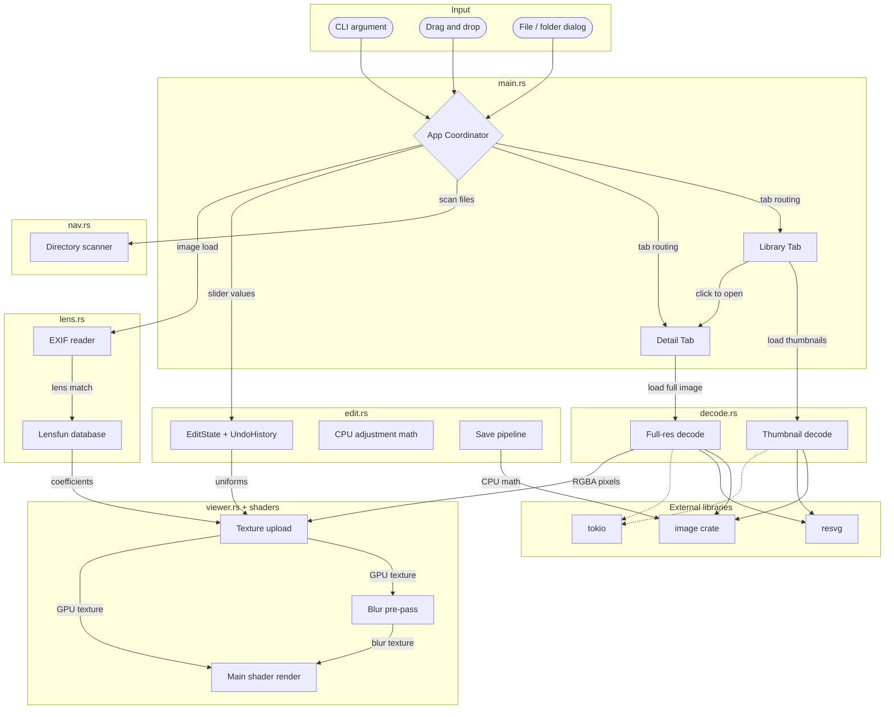

# Architecture

> Last verified: 2026-03-30
> Last updated by: agent

## System Overview

Photo is a GPU-accelerated image viewer and editor for Windows built in Rust. It provides a Library tab for browsing collections of images as a thumbnail grid, and a Detail tab for viewing individual images with zoom/pan and real-time editing via a custom wgpu shader pipeline. Users interact via the native iced GUI, keyboard shortcuts, file dialogs, drag-and-drop, or CLI arguments. Image editing includes 12 adjustments (exposure, contrast, highlights, shadows, whites, blacks, temperature, tint, vibrance, saturation, clarity, dehaze) rendered in the GPU shader at uniform-update cost, plus Lensfun-based lens corrections. Edits are non-destructive with undo/redo and save-as-copy.

## Component Map

### GUI Framework
- **iced application** (`src/main.rs`) — Top-level app state, message loop, tab routing, keyboard/event handling, and view composition. Owns: `App` struct, `Message` enum, `Tab`/`LibraryEntry`/`ContextMenu`/`DragState` types, `scan_folder_for_images()`. Includes collection sidebar in Library view.

### Viewer (Detail Tab)
- **ImageCanvas / shader pipeline** (`src/viewer.rs`) — Custom `iced::widget::shader::Program` implementation. Handles mouse interaction (zoom, pan, drag), computes image rect in UV space, and manages GPU resources (pipeline, textures, uniforms, bind groups). Owns: `ImageCanvas`, `ViewerEvent`, `ImagePrimitive`, `GpuResources`, `ViewerState`.
- **WGSL shader** (`assets/shaders/image.wgsl`) — Vertex/fragment shader for textured quad rendering with full adjustment pipeline. Receives extended uniforms (image rect, 12 adjustment floats, Bradford CAT matrix, lens correction coefficients). Applies sRGB linearization, exposure, temperature/tint, zone-based tone mapping, contrast S-curve, vibrance, saturation, clarity/dehaze (via blur texture), lens distortion/vignetting/TCA, and gamma encoding.
- **Blur shader** (`assets/shaders/blur.wgsl`) — 9-tap separable Gaussian blur shader for clarity/dehaze pre-pass. Two-pass (horizontal then vertical) at 1/4 resolution.

### Image Decoding
- **decode** (`src/decode.rs`) — Decodes raster images (via `image` crate) and SVG (via `resvg`). Handles GPU texture limit pre-downscale. Provides `decode_image()` for full-resolution loading and `decode_thumbnail()` for reduced-size thumbnails. Owns: `ImageData` struct (RGBA pixels + dimensions + file size).

### Image Editing
- **edit** (`src/edit.rs`) — Edit state management (`EditState`, `UndoHistory`), CPU-side adjustment math (sRGB conversion, exposure, contrast, tone zones, vibrance, saturation, clarity, dehaze, temperature/tint via Bradford CAT), and full-resolution save pipeline. Owns: `EditState`, `UndoHistory`, all `apply_*` functions, `save_edited_image()`.

### Lens Corrections
- **lens** (`src/lens.rs`) — Lensfun XML database parser, EXIF reader (via kamadak-exif), lens profile lookup. Provides distortion, vignetting, and TCA correction coefficients. Owns: `LensDatabase`, `LensProfile`, `ExifInfo`, `parse_lensfun_xml()`, `read_exif()`.

### Collections
- **collection** (`src/collection.rs`) — Named photo collections with JSON persistence. Owns: `CollectionStore`, `Collection`, `collections_file_path()`. Provides CRUD operations (create, rename, delete), photo add/remove, and save/load to `%LOCALAPPDATA%/photo/collections.json`.

### Navigation
- **nav** (`src/nav.rs`) — Directory scanning and file navigation. Sorts image files using natural ordering (`natord`). Provides next/prev cycling. Owns: `DirNav` struct, `IMAGE_EXTENSIONS` list, `is_image_file()`.

## Data Flow

### Image Loading (Detail View)
1. User triggers load (CLI arg, file dialog, drag-drop, library click, or arrow key).
2. `App::start_load()` spawns `tokio::task::spawn_blocking` → `decode::decode_image()`.
3. `decode_image()` reads file, decodes to RGBA8 pixels, downscales if >16384px.
4. `Message::ImageLoaded(Ok(Arc<ImageData>))` arrives in `App::update()`.
5. App stores the `Arc<ImageData>` and increments `image_id`.
6. On next `view()`, `ImageCanvas` passes data to shader's `prepare()`.
7. `prepare()` checks GPU texture limit, downscales if needed, uploads texture to GPU.
8. `render()` draws the textured quad with zoom/pan uniforms.

### Thumbnail Loading (Library View)
1. User picks a folder or files via `rfd` dialog.
2. `scan_folder_for_images()` finds image files, sorted naturally.
3. `App::load_thumbnails()` spawns a `Task::batch` of async decode jobs.
4. Each job calls `decode::decode_thumbnail(path, 200)` — decodes full, resizes to 200px max.
5. `Message::ThumbnailLoaded(path, data)` maps to `ImageHandle::from_rgba()` stored on the entry.
6. Library grid renders thumbnails via iced's built-in `Image` widget.

### Edit Data Flow
1. User drags slider in edit panel -> `Message::SliderChanged(kind, value)`.
2. `App::update()` writes value to `edit_histories[current_path].current.<field>`.
3. On `view()`, `App::build_adjustment_uniforms()` reads `EditState`, computes Bradford CAT matrix, assembles `AdjustmentUniforms`.
4. `ImageCanvas` passes `AdjustmentUniforms` through `ImagePrimitive` to `prepare()`.
5. `prepare()` writes all adjustment values to the GPU uniform buffer (~200 bytes).
6. `render()` draws the textured quad; the shader applies all adjustments per-pixel.
7. On slider release, `UndoHistory::commit()` pushes state to undo stack.
8. On save (Ctrl+S), CPU-side `apply_all()` mirrors the shader math at full resolution.

### Navigation Flow
1. Arrow keys in Detail tab check `library_index` first (library navigation mode).
2. If `library_index` is `None`, falls back to `DirNav` (directory navigation mode).
3. Library mode: cycles through `App::library` entries.
4. Directory mode: cycles through `DirNav::files` from the image's parent directory.

### Collection Flow
1. Collections loaded from `LOCALAPPDATA/photo/collections.json` on startup.
2. User creates/renames/deletes collections via sidebar UI.
3. Photos added via drag-and-drop (library → sidebar) or right-click context menu.
4. Adding stores a `PathBuf` reference — no file copying.
5. Removing a photo from a collection does not delete the file.
6. `CollectionStore::save()` writes JSON after every mutation.
7. Double-clicking a collection enters collection grid view (sub-view of Library tab).
8. Opening a photo from collection grid enters Detail view with collection-scoped navigation.

## Boundaries and Rules

### Ownership Rules
- Only `decode.rs` calls `image::open()`, `resvg::render()`, and performs pixel format conversion.
- Only `viewer.rs` interacts with wgpu (device, queue, textures, pipelines). All GPU work happens in the `shader::Primitive` trait methods.
- Only `nav.rs` scans directories and maintains the `IMAGE_EXTENSIONS` list.
- `main.rs` coordinates between modules but does not perform decoding or GPU operations directly.

### Module Boundaries
- Only `edit.rs` knows about adjustment math and undo/redo history.
- Only `lens.rs` reads EXIF data and parses Lensfun XML. All Lensfun access is through this module.
- `main.rs` coordinates: UI sliders -> `EditState` -> viewer uniforms.

- Only `collection.rs` manages collection persistence and CRUD. `main.rs` owns the `CollectionStore` instance and delegates all collection mutations to it.

### Off-Limits
- `assets/shaders/image.wgsl` — Shader source. Changes here must be reflected in the `Uniforms` struct and bind group layout in `viewer.rs`.
- `assets/shaders/blur.wgsl` — Blur shader source. Changes must be reflected in blur pipeline setup in `viewer.rs`.

### Integration Boundaries
- File dialogs go through `rfd::AsyncFileDialog` only. All dialog calls live in `main.rs`.
- Image decoding is always async via `tokio::task::spawn_blocking` — never on the main/UI thread.
- wgpu access is exclusively through iced's re-export (`iced::widget::shader::wgpu`), not a standalone `wgpu` crate.

## Key Architectural Decisions

| Decision | Choice | Why | Date |
| --- | --- | --- | --- |
| GUI framework | iced 0.13 | Rust-native, wgpu integration via `shader::Program`, no GC | 2026-03-29 |
| GPU rendering | Custom wgpu shader via iced's `shader::Primitive` | Direct control over texture upload, zoom/pan uniforms, and render pass | 2026-03-29 |
| wgpu version | iced's bundled wgpu 0.19 re-export | Using standalone wgpu causes type mismatches with iced's shader traits | 2026-03-29 |
| SVG rendering | resvg | Rasterizes SVG to pixels on CPU, then uploads as texture — same pipeline as raster images | 2026-03-29 |
| Thumbnail strategy | Decode full image, resize to 200px max | Simple, reuses existing decode path. Optimization deferred. | 2026-03-29 |
| Thumbnail display | iced `Image` widget with `Handle::from_rgba` | Pre-decoded pixel data avoids iced re-decoding. Coexists with shader viewer. | 2026-03-29 |
| Dual navigation | `library_index` (library mode) vs `DirNav` (directory mode) | Library browsing and direct file opening are independent use cases | 2026-03-29 |
| Async decoding | `tokio::task::spawn_blocking` | Keeps UI responsive. iced's tokio feature provides the runtime. | 2026-03-29 |
| GPU texture limit | Runtime query in `prepare()`, downscale if exceeded | Limit varies per GPU (8192 integrated, 16384+ discrete). Can't hardcode. | 2026-03-30 |

## Technology Map

| Layer | Technology | Version | Notes |
| --- | --- | --- | --- |
| GUI | iced | 0.13 | Features: tokio, advanced, image |
| GPU | wgpu | 0.19 | Via iced re-export, not standalone |
| Shader | WGSL | — | `assets/shaders/image.wgsl` |
| Image decode | image crate | 0.24 | 13 format features enabled |
| JPEG thumbnails | jpeg-decoder | 0.3 | DCT-level downscaling for fast thumbnail decode |
| SVG | resvg | 0.44 | Includes usvg + tiny-skia |
| File dialogs | rfd | 0.15 | Async file/folder pickers |
| Async runtime | tokio | 1.x | Multi-thread, via iced feature |
| GPU uniforms | bytemuck | 1.x | Pod/Zeroable derive for uniform struct |
| Natural sort | natord | 1.0 | Filename ordering in nav and library |
| EXIF reading | kamadak-exif | 0.6 | Camera/lens EXIF metadata extraction |
| XML parsing | quick-xml | 0.37 | Lensfun XML database parsing |
| JSON serialization | serde + serde_json | 1.x / 1.x | Collection persistence |
| Logging | env_logger + log | 0.11 / 0.4 | Debug logging |

## Diagram

## Drift Log

| Date | What Changed | Why | Updated By |
| --- | --- | --- | --- |
| 2026-03-29 | Initial architecture doc created from template | Project reached stable multi-module state with Library/Detail tabs | agent |
| 2026-03-30 | Added jpeg-decoder direct dependency | DCT-level downscaling for fast JPEG thumbnails; was already a transitive dep | agent |
| 2026-03-30 | Added image editing system (edit.rs, lens.rs, extended shader, blur pre-pass) | 12 GPU shader-based adjustments, Lensfun lens corrections, undo/redo, save-as-copy | agent |
| 2026-03-30 | Added kamadak-exif and quick-xml dependencies | EXIF reading for lens auto-detection, Lensfun XML database parsing | agent |
| 2026-04-03 | Added collection module (collection.rs) and sidebar UI integration | Named photo collections with JSON persistence, collection sidebar in Library view, context menu/drag types, 19 new message variants (stubbed) | agent |
| 2026-04-03 | Completed collections system (collection.rs, sidebar UI, context menus, drag-drop, grid view, detail nav) | Named photo collections with JSON persistence, context menu overlay, drag-and-drop, collection-scoped navigation | agent |
| 2026-04-03 | Added serde and serde_json dependencies | JSON serialization for collection persistence | agent |
