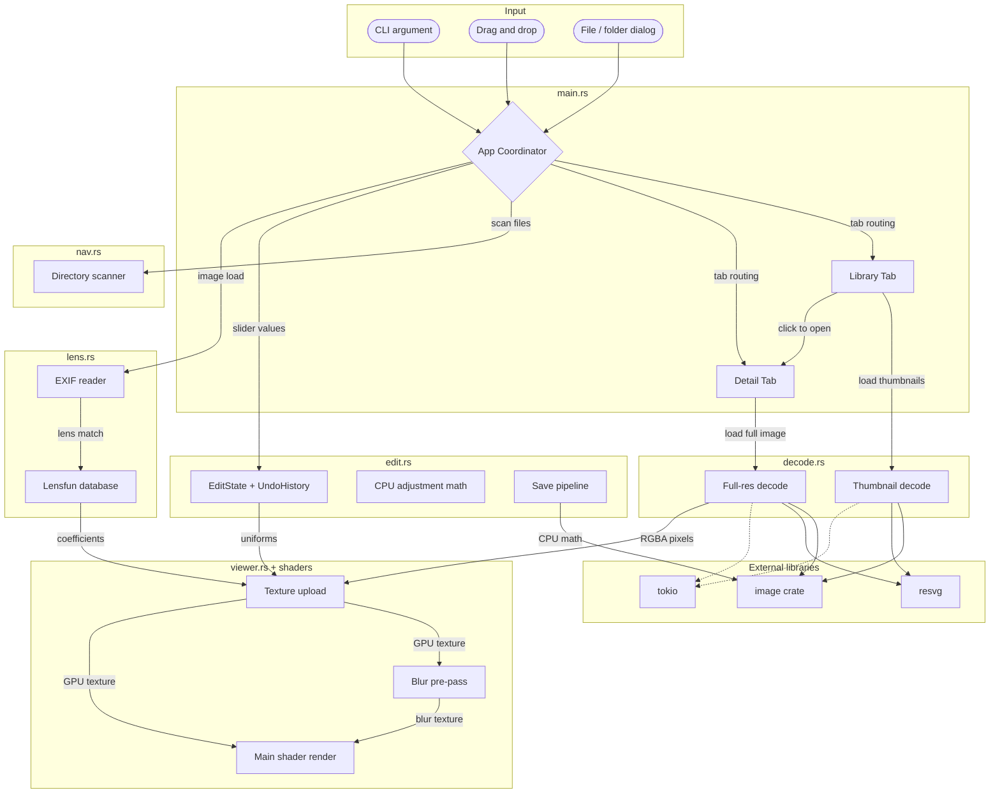

# Architecture

> Last verified: 2026-04-19
> Last updated by: codex

## System Overview

Photo is a GPU-accelerated image viewer and editor for Windows written in Rust. It has a Library tab for browsing image collections as a thumbnail grid and a Detail tab for viewing individual images with zoom/pan and real-time editing through a custom wgpu shader pipeline. Users interact through the iced GUI, keyboard shortcuts, file dialogs, drag-and-drop, or CLI arguments. Image editing includes 12 adjustments rendered in the GPU shader at uniform-update cost, plus Lensfun-based lens corrections. The decode path now covers raster, SVG, and common camera RAW formats. Edits are non-destructive with undo/redo and save-as-copy.

## Component Map

- `src/main.rs`: iced application state, message loop, tab routing, keyboard/event handling, view composition, and collection sidebar wiring.
- `src/viewer.rs`: custom `iced::widget::shader::Program` for zoom, pan, texture upload, uniforms, and GPU resource management.
- `assets/shaders/image.wgsl`: textured quad shader with exposure, tone zones, contrast, vibrance, saturation, clarity, dehaze, lens distortion, vignetting, TCA, and gamma encoding.
- `assets/shaders/blur.wgsl`: 9-tap separable Gaussian blur pre-pass for clarity/dehaze.
- `src/decode.rs`: raster, SVG, and RAW decoding, including GPU texture limit pre-downscale, thumbnail-first RAW embedded-image extraction for library loads, raw-pixel-first detail decoding, embedded-image fallback for detail loads, and thumbnail loading.
- `src/edit.rs`: edit state, undo/redo, CPU-side adjustment math, and save pipeline.
- `src/lens.rs`: Lensfun XML parsing, EXIF reading, and lens profile lookup.
- `src/collection.rs`: collection CRUD and JSON persistence.
- `src/nav.rs`: directory scanning and file navigation with natural sorting.

## Data Flow

### Image Loading
1. The user triggers image load from the CLI, file dialog, drag-and-drop, library click, or arrow keys.
2. `App::start_load()` spawns `tokio::task::spawn_blocking` and calls `decode::decode_image()`.
3. `decode_image()` reads the file, decodes raster or SVG content directly, or develops RAW pixel data first and only falls back to embedded full images or previews if the higher-quality path is unavailable.
4. `Message::ImageLoaded` arrives in `App::update()`.
5. The app stores the image, updates `image_id`, and passes the data into the viewer on the next render.
6. `prepare()` checks the runtime GPU texture limit and uploads the texture.
7. `render()` draws the textured quad with zoom/pan uniforms.

### Thumbnail Loading
1. The user picks a folder or files with `rfd`.
2. `scan_folder_for_images()` finds and naturally sorts image files.
3. `App::load_thumbnails()` launches async decode jobs.
4. Each job calls `decode::decode_thumbnail(path, 200)`, which prefers embedded RAW thumbnails/previews when the source is a camera RAW file.
5. Thumbnails are stored as `ImageHandle::from_rgba()` and rendered in the Library grid.

### Edit and Save Flow
1. Sliders update `EditState` in `App::update()`.
2. `App::build_adjustment_uniforms()` converts state into shader-friendly uniforms.
3. `ImageCanvas` sends uniforms to `prepare()`, which writes the GPU uniform buffer.
4. The shader applies the adjustments per pixel.
5. `UndoHistory::commit()` stores committed states on slider release.
6. `apply_all()` mirrors the shader math at full resolution during save.

### Navigation and Collections
1. Arrow-key navigation prefers `library_index` and falls back to `DirNav`.
2. Collections load from `%LOCALAPPDATA%/photo/collections.json`.
3. Collection mutations go through `CollectionStore`.
4. Photos can be added or removed through context menus or drag-and-drop.
5. Double-clicking a collection enters collection grid view, and opening a photo from that grid enters Detail view with collection-scoped navigation.

## Boundaries and Rules

- Only `decode.rs` calls `image::open()`, `resvg::render()`, `rawler` decode/develop APIs, and performs pixel-format conversion.
- Only `viewer.rs` interacts with wgpu objects directly.
- Only `nav.rs` scans directories and owns the image-extension list.
- Only `edit.rs` owns adjustment math and undo/redo history.
- Only `lens.rs` parses Lensfun XML and reads EXIF data.
- Only `collection.rs` manages collection persistence and CRUD.
- File dialogs go through `rfd::AsyncFileDialog`.
- Image decoding is always async through `tokio::task::spawn_blocking`.
- wgpu access stays behind iced's re-export.

## Technology Map

| Layer | Technology | Version | Notes |
| --- | --- | --- | --- |
| GUI | iced | 0.13 | Features: tokio, advanced, image |
| GPU | wgpu | 0.19 | Via iced re-export |
| Shader | WGSL | - | `assets/shaders/image.wgsl` |
| Image decode | image crate | 0.24 | Raster decoding |
| RAW decode | rawler | 0.7 | Embedded preview extraction with raw-pixel development fallback |
| JPEG thumbnails | jpeg-decoder | 0.3 | Fast thumbnail downscaling |
| SVG | resvg | 0.44 | CPU rasterization before upload |
| File dialogs | rfd | 0.15 | Async file/folder pickers |
| Async runtime | tokio | 1.x | Multi-thread runtime |
| GPU uniforms | bytemuck | 1.x | Pod/Zeroable derives |
| Natural sort | natord | 1.0 | Filename ordering |
| EXIF reading | kamadak-exif | 0.6 | Camera/lens metadata extraction |
| XML parsing | quick-xml | 0.37 | Lensfun XML database parsing |
| JSON serialization | serde + serde_json | 1.x / 1.x | Collection persistence |
| Logging | env_logger + log | 0.11 / 0.4 | Debug logging |

## Diagram

## See Also

- [Architectural decisions](decisions.md)
- [Architecture drift log](drift-log.md)
