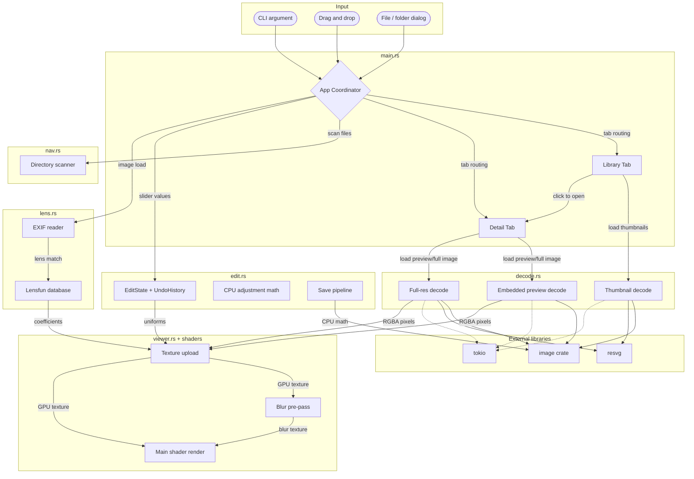

# Architecture

> Last verified: 2026-04-22
> Last updated by: codex

## System Overview

Photo is a GPU-accelerated image viewer and editor for Windows written in Rust. It has a Library tab for browsing image collections as a thumbnail grid and a Detail tab for viewing individual images with zoom/pan and real-time editing through a custom wgpu shader pipeline. Users interact through the iced GUI, keyboard shortcuts, file dialogs, drag-and-drop, or CLI arguments. Image editing includes 12 adjustments rendered in the GPU shader at uniform-update cost, plus Lensfun-based lens corrections, 90-degree rotation, and crop preview/export support. The decode path now covers raster, SVG, and common camera RAW formats, and RAW Detail view uses a staged load that shows an embedded preview first when available before upgrading to the fully developed image. Edits remain non-destructive within a session, committed edits bake into repo-local local-copy files across restarts with source-metadata validation and paired full/thumbnail generations, and save-as-copy still exports a separate edited file.

## Component Map

- `src/main.rs`: iced application state, message loop, tab routing, keyboard/event handling, `DetailLoadState`-based staged Detail-load orchestration, crop/rotation tool wiring, view composition, collection sidebar wiring, local library persistence, session edit history, and repo-local baked local-edit persistence.
- `src/viewer.rs`: custom `iced::widget::shader::Program` for zoom, pan, crop selection overlay, texture upload, uniforms, and GPU resource management.
- `assets/shaders/image.wgsl`: textured quad shader with exposure, tone zones, contrast, vibrance, saturation, clarity, dehaze, crop preview/overlay handling, lens distortion, vignetting, TCA, and gamma encoding.
- `assets/shaders/blur.wgsl`: 9-tap separable Gaussian blur pre-pass for clarity/dehaze.
- `src/decode.rs`: raster, SVG, and RAW decoding, including GPU texture limit pre-downscale, thumbnail-first RAW embedded-image extraction for library loads, staged embedded-preview-plus-full-detail RAW loading, and thumbnail loading.
- `src/edit.rs`: edit state, undo/redo, CPU-side adjustment math, and save pipeline.
- `src/lens.rs`: Lensfun XML parsing, EXIF reading, and lens profile lookup.
- `src/collection.rs`: collection CRUD and JSON persistence.
- `src/nav.rs`: directory scanning and file navigation with natural sorting.

## Data Flow

### Image Loading
1. The user triggers image load from the CLI, file dialog, drag-and-drop, library click, or arrow keys.
2. `App::start_load()` advances `DetailLoadState`, clears stale image/metadata state, and chooses the load plan up front.
3. Raster and SVG files go straight to blocking `decode::decode_image()` plus async EXIF loading.
4. RAW files start with `decode::decode_embedded_preview()` so Detail can show an embedded image quickly; only the still-current request then launches the heavier full-resolution decode plus EXIF follow-up work.
5. `Message::ImagePreviewLoaded`, `Message::ImageLoaded`, and `Message::ExifLoaded` arrive in `App::update()`, each tagged with the active request id so stale async completions are ignored.
6. The app can display the embedded RAW preview immediately, then replace it in place with the full developed image without resetting the user's zoom/pan state.
7. EXIF and lens-profile lookup complete asynchronously and can update the viewer after the image is already visible.
8. `prepare()` checks the runtime GPU texture limit and uploads the current image texture.
9. `render()` draws the textured quad with zoom/pan uniforms.

### Thumbnail Loading
1. The user picks a folder or files with `rfd`.
2. `scan_folder_for_images()` finds and naturally sorts image files.
3. `App::load_thumbnails()` launches async decode jobs.
4. Each job loads a thumbnail base image, preferring a baked repo-local local-edit thumbnail only when it matches the persisted full local copy for the same generation and otherwise deriving from that full local copy or falling back to `decode::decode_thumbnail(path, 200)`, which prefers embedded RAW thumbnails/previews when the source is a camera RAW file.
5. Thumbnails are stored as the base `ImageData`, rendered into `ImageHandle::from_rgba()`, and refreshed immediately after committed edits so Library reflects the visible Detail image.

### Edit and Save Flow
1. Sliders plus Detail-view crop/rotation controls update `EditState` in `App::update()`.
2. `App::build_adjustment_uniforms()` converts state into shader-friendly uniforms, including committed crop preview state.
3. `ImageCanvas` sends uniforms to `prepare()`, which writes the GPU uniform buffer.
4. The shader applies the adjustments per pixel and dims outside the active crop overlay while crop mode is active.
5. `UndoHistory::commit()` stores committed states on slider release and crop/rotation commits.
6. After each committed edit, `main.rs` captures the current visible render as a snapshot, uses that same snapshot to refresh Library immediately, and bakes it into repo-local files under `local-edits/`, writing both a full-size local copy and a thumbnail-sized copy keyed by the source path.
7. The persisted full and thumbnail copies share a generation id and source metadata header so partial writes or stale source rewrites fail closed instead of silently reopening mismatched pixels.
8. Reopening an image in a later session prefers that baked local copy as the new base image, while undo/redo stacks remain memory-only and are not restored after restart.
9. `apply_all()` mirrors the shader math at full resolution during save, and the save path applies crop bounds after rotation so preview and export stay aligned.

### Navigation and Collections
1. Arrow-key navigation prefers `library_index` and falls back to `DirNav`.
2. Library paths load from `%LOCALAPPDATA%/photo/library.txt`, and baked per-image local copies load from the repo-local `local-edits/` directory when present and still valid for the current source metadata.
3. Collections load from `%LOCALAPPDATA%/photo/collections.json`.
4. Collection mutations go through `CollectionStore`.
5. Photos can be added or removed through context menus or drag-and-drop.
6. Double-clicking a collection enters collection grid view, and opening a photo from that grid enters Detail view with collection-scoped navigation.

## Boundaries and Rules

- Only `decode.rs` calls `image::open()`, `resvg::render()`, `rawler` decode/develop APIs, and performs pixel-format conversion.
- Only `viewer.rs` interacts with wgpu objects directly.
- Only `nav.rs` scans directories and owns the image-extension list.
- Only `edit.rs` owns adjustment math and undo/redo history.
- Only `lens.rs` parses Lensfun XML and reads EXIF data.
- Only `collection.rs` manages collection persistence and CRUD.
- Only `main.rs` manages library-path persistence, session edit histories, and repo-local baked local-edit persistence.
- File dialogs go through `rfd::AsyncFileDialog`.
- Image decoding is always async through `tokio::task::spawn_blocking`.
- wgpu access stays behind iced's re-export.

## Technology Map

| Layer | Technology | Version | Notes |
| --- | --- | --- | --- |
| GUI | iced | 0.13 | Features: tokio, advanced, image |
| GPU | wgpu | 0.19 | Via iced re-export |
| Shader | WGSL | - | `assets/shaders/image.wgsl` |
| Image decode | image crate | 0.24 | Raster decoding |
| RAW decode | rawler | 0.7 | Embedded preview extraction plus staged full-resolution RAW development |
| JPEG thumbnails | jpeg-decoder | 0.3 | Fast thumbnail downscaling |
| SVG | resvg | 0.44 | CPU rasterization before upload |
| File dialogs | rfd | 0.15 | Async file/folder pickers |
| Async runtime | tokio | 1.x | Multi-thread runtime |
| GPU uniforms | bytemuck | 1.x | Pod/Zeroable derives |
| Natural sort | natord | 1.0 | Filename ordering |
| EXIF reading | kamadak-exif | 0.6 | Camera/lens metadata extraction |
| XML parsing | quick-xml | 0.37 | Lensfun XML database parsing |
| JSON serialization | serde + serde_json | 1.x / 1.x | Collection persistence |
| Logging | env_logger + log | 0.11 / 0.4 | Debug logging |

## Diagram

## See Also

- [Architectural decisions](decisions.md)
- [Architecture drift log](drift-log.md)
