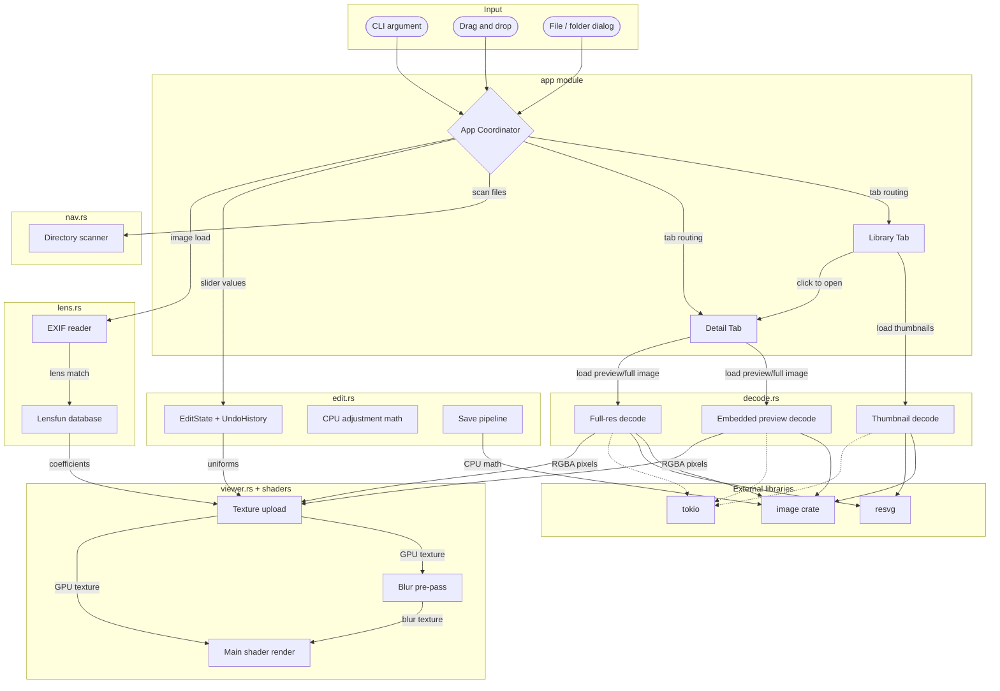

# Architecture

> Last verified: 2026-06-11
> Last updated by: claude

## System Overview

Photo is a GPU-accelerated image viewer and editor for Windows written in Rust. It has a Library tab for browsing image collections as a thumbnail grid and a Detail tab for viewing individual images with zoom/pan and real-time editing through a custom wgpu shader pipeline. Users interact through the iced GUI, keyboard shortcuts, file dialogs, drag-and-drop, or CLI arguments. Image editing includes 12 adjustments rendered in the GPU shader at uniform-update cost, plus Lensfun-based lens corrections, 90-degree rotation, and crop preview/export support. The decode path now covers raster, SVG, and common camera RAW formats, and RAW Detail view uses a staged load that shows an embedded preview first when available before upgrading to the fully developed image. Edits remain non-destructive within a session, committed edits bake into repo-local local-copy files across restarts with source-metadata validation and paired full/thumbnail generations, and save-as-copy still exports a separate edited file. Baked local edits stay authoritative when the source media is offline: library membership, edited thumbnails, and Detail opening all work without the original file present (a reachable-but-rewritten source still invalidates the bake).

## Component Map

- `src/main.rs`: thin entry point — iced application wiring only.
- `src/app/mod.rs`: `App` state, `Message` enum, shared UI types (`Tab`, `SliderKind`, `CropAspect`, context-menu/drag state, `SaveRequest`), lifecycle (`new`/`title`/`theme`/`subscription`), shared state accessors, zoom/fit math, and slider-field mapping.
- `src/app/update.rs`: the message loop — `update()`, viewer/window/keyboard event handlers, library mutations, import cache-warm queue, local-edit persist orchestration, and staged Detail-load task wiring.
- `src/app/view.rs`: view composition — tab bar, library and collection grids, detail editor panel, status bar, context-menu/drag overlays, and adjustment-uniform building.
- `src/app/tests.rs`: app-level regression tests (still hosts tests for extracted subsystems; redistributing them to their home modules is a tracked follow-up).
- `src/theme.rs`: color palette constants and iced style functions.
- `src/widgets.rs`: reusable widget builders — rotation buttons, thumbnail slots, thumbnail grid layout math, section labels/dividers, context-menu items.
- `src/detail_load.rs`: `DetailLoadStage`/`DetailLoadState` staged Detail-load lifecycle.
- `src/session_cache.rs`: `SourceFileFingerprint` validation plus the in-memory same-session full-image cache.
- `src/local_edits.rs`: repo-local baked local-edit persistence — cache file format, paired full/thumbnail generations, validation, thumbnail repair, and the persist task core. Lookups resolve through reachability-independent candidate path keys, and validation fails open to the bake when the source file is absent (fails closed when it is present but its metadata changed).
- `src/loading.rs`: `LoadedFullImage`/`BaseImageSource`/`LoadedThumbnailBase` types plus full-image and library-thumbnail base loading that prefers valid baked local edits and reports each thumbnail base's provenance.
- `src/library.rs`: `LibraryEntry`, `library.txt` persistence (offline paths are kept — membership is user intent), and file-dialog extension wiring.
- `src/repo.rs`: photo repo-root discovery and its test override (decode.rs keeps a pre-existing duplicate; dedup is a tracked follow-up).
- `src/viewer.rs`: custom `iced::widget::shader::Program` for zoom, pan, crop selection overlay, texture upload, uniforms, and GPU resource management.
- `assets/shaders/image.wgsl`: textured quad shader with exposure, tone zones, contrast, vibrance, saturation, clarity, dehaze, crop preview/overlay handling, lens distortion, vignetting, TCA, and gamma encoding.
- `assets/shaders/blur.wgsl`: 9-tap separable Gaussian blur pre-pass for clarity/dehaze.
- `src/decode.rs`: raster, SVG, and RAW decoding, including GPU texture limit pre-downscale, thumbnail-first RAW embedded-image extraction for library loads, staged embedded-preview-plus-full-detail RAW loading, thumbnail loading, and a repo-local persisted decoded-image cache under `decoded-cache/` (versioned schema/contract, normalized path keys, source-fingerprint validation, collision-safe temp writes, and bounded LRU-style retention).
- `src/edit.rs`: edit state, undo/redo, CPU-side adjustment math, and save pipeline.
- `src/lens.rs`: Lensfun XML parsing, EXIF reading, and lens profile lookup.
- `src/collection.rs`: collection CRUD and JSON persistence.
- `src/nav.rs`: directory scanning and file navigation with natural sorting.

## Data Flow

### Image Loading
1. The user triggers image load from the CLI, file dialog, drag-and-drop, library click, or arrow keys.
2. `App::start_load()` advances `DetailLoadState`, clears stale image/metadata state, and chooses the load plan up front. A same-image return from Library short-circuits before `start_load()` when the visible Detail image is still valid; otherwise an in-memory same-session full-image cache (with a small recent-history floor) can serve repeat opens immediately under a write-denying read handle.
3. Raster files go straight to blocking `decode::decode_image()` plus async EXIF loading.
4. RAW and SVG files consult the repo-local `decoded-cache/` first (validated by source fingerprint and an explicit cache-contract version); RAW files additionally start with `decode::decode_embedded_preview()` so Detail can show an embedded image quickly, and only the still-current request then launches the heavier full-resolution decode plus EXIF follow-up work.
5. `Message::ImagePreviewLoaded`, `Message::ImageLoaded`, and `Message::ExifLoaded` arrive in `App::update()`, each tagged with the active request id so stale async completions are ignored.
6. The app can display the embedded RAW preview immediately, then replace it in place with the full developed image without resetting the user's zoom/pan state.
7. EXIF and lens-profile lookup complete asynchronously and can update the viewer after the image is already visible.
8. Newly imported RAW/SVG files enqueue a serial background warm of the persisted decoded-cache so later opens hit the cache without blocking the import path.
9. `prepare()` checks the runtime GPU texture limit and uploads the current image texture.
10. `render()` draws the textured quad with zoom/pan uniforms.

### Thumbnail Loading
1. The user picks a folder or files with `rfd`.
2. `scan_folder_for_images()` finds and naturally sorts image files.
3. `App::load_thumbnails()` launches async decode jobs.
4. Each job loads a thumbnail base image, preferring a baked repo-local local-edit thumbnail only when it matches the persisted full local copy for the same generation and otherwise deriving from that full local copy or falling back to `decode::decode_thumbnail(path, 200)`, which prefers embedded RAW thumbnails/previews when the source is a camera RAW file. Baked thumbnails resolve and validate without the source file present, so edited entries render offline.
5. Thumbnails are stored as the base `ImageData` tagged with its provenance and rendered into `ImageHandle::from_rgba()`. Session edit state renders only onto `Original` bases — baked bases already contain their edits, and only the persist pipeline replaces them — and they refresh immediately after committed edits so Library reflects the visible Detail image.

### Edit and Save Flow
1. Sliders plus Detail-view crop/rotation controls update `EditState` in `App::update()`.
2. `App::build_adjustment_uniforms()` converts state into shader-friendly uniforms, including committed crop preview state.
3. `ImageCanvas` sends uniforms to `prepare()`, which writes the GPU uniform buffer.
4. The shader applies the adjustments per pixel and dims outside the active crop overlay while crop mode is active.
5. `UndoHistory::commit()` stores committed states on slider release and crop/rotation commits.
6. After each committed edit, `app/update.rs` captures the current visible render as a snapshot, uses that same snapshot to refresh Library immediately, and bakes it through `local_edits.rs` into repo-local files under `local-edits/`, writing both a full-size local copy and a thumbnail-sized copy keyed by the source path. A commit made while the full-resolution decode is still in flight cannot bake yet; if the user navigates away first, the obligation is recorded against the superseded load request and fulfilled when that decode completes (`owed_local_edit_bakes`).
7. The persisted full and thumbnail copies share a generation id and source metadata header so partial writes or stale source rewrites fail closed instead of silently reopening mismatched pixels. When the source file is absent (offline media), the bake is authoritative and loads without the metadata comparison.
8. Reopening an image in a later session prefers that baked local copy as the new base image, while undo/redo stacks remain memory-only and are not restored after restart.
9. `apply_all()` mirrors the shader math at full resolution during save, and the save path applies crop bounds after rotation so preview and export stay aligned.

### Navigation and Collections
1. Arrow-key navigation prefers `library_index` and falls back to `DirNav`.
2. Library paths load from `%LOCALAPPDATA%/photo/library.txt` — including paths whose media is currently offline, so entries survive unplugged cards and drive-letter changes — and baked per-image local copies load from the repo-local `local-edits/` directory when present and valid (metadata-checked against a reachable source, served as-is for an absent one).
3. Collections load from `%LOCALAPPDATA%/photo/collections.json`.
4. Collection mutations go through `CollectionStore`.
5. Photos can be added or removed through context menus or drag-and-drop.
6. Double-clicking a collection enters collection grid view, and opening a photo from that grid enters Detail view with collection-scoped navigation.

## Boundaries and Rules

- Only `decode.rs` calls `image::open()`, `resvg::render()`, `rawler` decode/develop APIs, and performs pixel-format conversion.
- Only `viewer.rs` interacts with wgpu objects directly.
- Only `nav.rs` scans directories and owns the image-extension list.
- Only `edit.rs` owns adjustment math and undo/redo history.
- Only `lens.rs` parses Lensfun XML and reads EXIF data.
- Only `collection.rs` manages collection persistence and CRUD.
- Only `library.rs` manages library-path persistence; only `session_cache.rs` owns the in-memory same-session full-image cache; only `local_edits.rs` reads/writes the repo-local `local-edits/` directory; the `app/` module owns session edit histories and all orchestration.
- Only `decode.rs` reads/writes the repo-local `decoded-cache/` directory.
- File dialogs go through `rfd::AsyncFileDialog`.
- Image decoding is always async through `tokio::task::spawn_blocking`.
- wgpu access stays behind iced's re-export.

## Technology Map

| Layer | Technology | Version | Notes |
| --- | --- | --- | --- |
| GUI | iced | 0.13 | Features: tokio, advanced, image |
| GPU | wgpu | 0.19 | Via iced re-export |
| Shader | WGSL | - | `assets/shaders/image.wgsl` |
| Image decode | image crate | 0.24 | Raster decoding |
| RAW decode | rawler | 0.7 | Embedded preview extraction plus staged full-resolution RAW development |
| JPEG thumbnails | jpeg-decoder | 0.3 | Fast thumbnail downscaling |
| SVG | resvg | 0.44 | CPU rasterization before upload |
| File dialogs | rfd | 0.15 | Async file/folder pickers |
| Async runtime | tokio | 1.x | Multi-thread runtime |
| GPU uniforms | bytemuck | 1.x | Pod/Zeroable derives |
| Natural sort | natord | 1.0 | Filename ordering |
| EXIF reading | kamadak-exif | 0.6 | Camera/lens metadata extraction |
| XML parsing | quick-xml | 0.37 | Lensfun XML database parsing |
| JSON serialization | serde + serde_json | 1.x / 1.x | Collection persistence |
| Logging | env_logger + log | 0.11 / 0.4 | Debug logging |

## Diagram

```mermaid
flowchart TD
    subgraph Input
        CLI([CLI argument])
        Drop([Drag and drop])
        Picker([File / folder dialog])
    end

    subgraph UI[app module]
        App{App Coordinator}
        Library[Library Tab]
        Detail[Detail Tab]
    end

    subgraph Decode[decode.rs]
        Full[Full-res decode]
        Preview[Embedded preview decode]
        Thumb[Thumbnail decode]
    end

    subgraph Nav[nav.rs]
        DirNav[Directory scanner]
    end

    subgraph Edit[edit.rs]
        EditState[EditState + UndoHistory]
        CPUMath[CPU adjustment math]
        Save[Save pipeline]
    end

    subgraph Lens[lens.rs]
        LensDB[Lensfun database]
        EXIF[EXIF reader]
    end

    subgraph GPU[viewer.rs + shaders]
        Prepare[Texture upload]
        Blur[Blur pre-pass]
        Render[Main shader render]
    end

    subgraph Ext[External libraries]
        ImageCrate[image crate]
        Resvg[resvg]
        Tokio[tokio]
    end

    CLI --> App
    Drop --> App
    Picker --> App
    App -->|tab routing| Library
    App -->|tab routing| Detail
    App -->|scan files| DirNav
    Library -->|load thumbnails| Thumb
    Detail -->|load preview/full image| Preview
    Detail -->|load preview/full image| Full
    Library -->|click to open| Detail
    Thumb --> ImageCrate
    Thumb --> Resvg
    Preview --> ImageCrate
    Full --> ImageCrate
    Full --> Resvg
    Thumb -.-> Tokio
    Preview -.-> Tokio
    Full -.-> Tokio
    App -->|slider values| EditState
    EditState -->|uniforms| Prepare
    App -->|image load| EXIF
    EXIF -->|lens match| LensDB
    LensDB -->|coefficients| Prepare
    Preview -->|RGBA pixels| Prepare
    Full -->|RGBA pixels| Prepare
    Prepare -->|GPU texture| Blur
    Blur -->|blur texture| Render
    Prepare -->|GPU texture| Render
    Save -->|CPU math| ImageCrate
```

## See Also

- [Architectural decisions](decisions.md)
- [Architecture drift log](drift-log.md)
